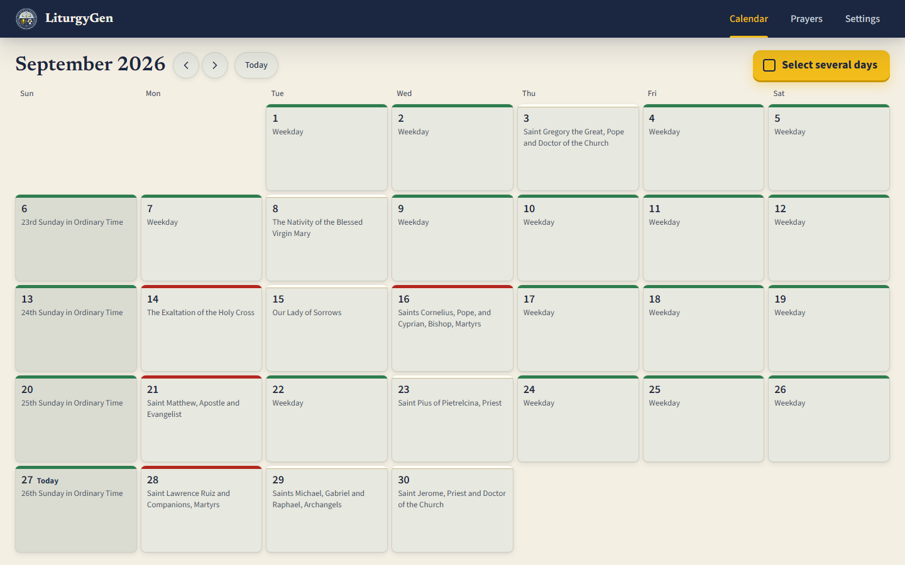
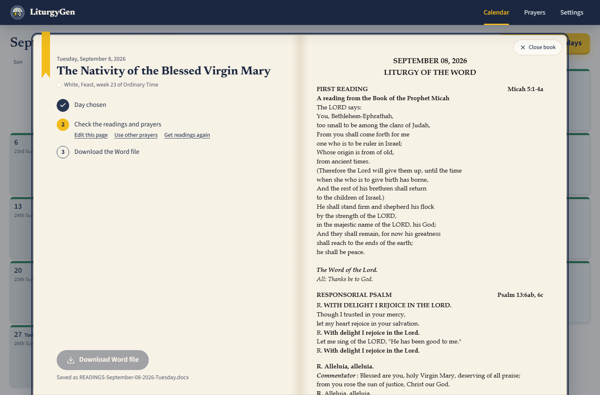
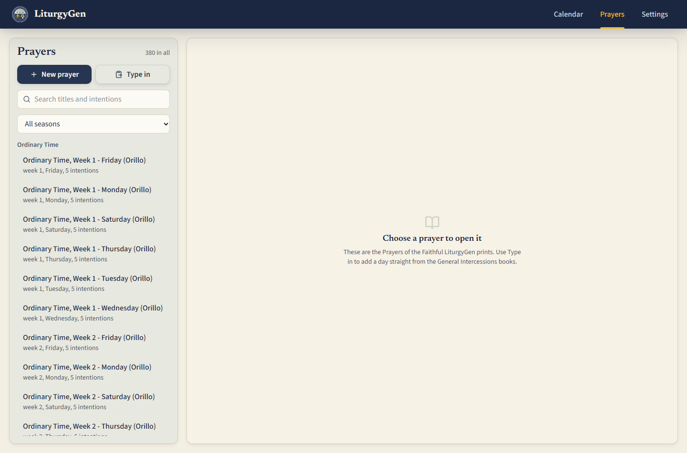

# LiturgyGen

Mass readings missalette and Prayers of the Faithful generator for a Campus
Ministry Office. Pick the days you have a Mass — one, or a month of them — and
LiturgyGen works out the liturgical day, fetches that day's readings, attaches
the right Prayers of the Faithful, and hands back a `.docx` laid out exactly
like the office's printed missalette.

**Live site:** https://damudachi.github.io/LiturgyGen/
**API:** not deployed yet — see [What I would do next](#what-i-would-do-next)
**Demo video:** week 3

> **The live site is running in demo mode.** The interface is real; the backend
> is simulated in your browser so the page works without a server. The calendar
> is a snapshot of September and October 2026, the readings are citations
> without their text, and the prayers are placeholders. See
> [Demo mode](#demo-mode).

## What it does

- **Work out the liturgical day** for any date on the Philippine particular
  calendar — season, week, rank, colour — including the local celebrations the
  `romcal` library does not carry.
- **Fetch the readings** from USCCB, with Evangelizo as a fallback, a permanent
  on-disk cache, and a paste box for the date neither source can reach.
- **Attach the Prayers of the Faithful**, matched by a seven-tier cascade from
  the celebration down to the Ordinary Time book for the same weekday.
- **Show the missalette as it will print**, on the facing page, in the same font
  the Word file uses.
- **Make a month at once** — a ZIP of one file per day, or one master document —
  with the days that need a look flagged and listed first before anything is
  made.
- **Type the intercession books in once**, from the printed page, and keep them.

| The day book | The Prayers library |
| --- | --- |
|  |  |

## Built with

React and Vite on the front end, Express and **PostgreSQL** on the back end.
The app runs as one Render web service - Express serves the built client and
the API from the same origin - with PostgreSQL on Neon. It is behind HTTP Basic
Authentication, so the URL alone will not open it; `/healthz` and `/readyz` are
outside the gate and answer unauthenticated. GitHub Pages carries a separate
client-only build that runs against a seeded snapshot in the browser, needs no
login, and says so on the page.

The database was SQLite until week 3;
[`docs/07-postgres-migration-map.md`](docs/07-postgres-migration-map.md) is the
record of the move and of the six things it turned up.

There is also a **Windows desktop build** — the same app in its own window with
a bundled Node runtime, installed per-user with no administrator rights. See
[Desktop build](#desktop-build).

## Demo mode

This repository runs two ways, chosen by one environment variable at **build**
time.

**Demo mode is the default.** Only the exact string `false` turns it off, so a
forgotten or mistyped variable leaves you on the simulated backend with a
visible notice rather than on a silently broken build.

| `VITE_USE_MOCK_API` | What happens |
| --- | --- |
| unset, or `true` | `client/src/api/mockApi.js` answers every request from `seed.json` and `localStorage`. No server, no database, nothing shared between visitors. |
| `false` | The client calls the Express API at `VITE_API_BASE_URL`, which reads and writes the real database. |

The two implementations sit behind one interface in `client/src/api/index.js`,
so no component knows which one it is talking to.

**What the demo deliberately does not have.** `seed.json` is committed to a
public repository, so `server/tools/build-demo-seed.mjs` strips two things
before writing it:

- **The scripture text.** The readings are the New American Bible, copyright
  USCCB and the Confraternity of Christian Doctrine. Citations are references
  and are fine; the text is not ours to redistribute, so every passage is
  replaced with one stand-in line.
- **The office's prayers.** Those are transcribed from two published ST PAULS
  volumes and never leave a git-ignored folder. The demo ships the placeholder
  prayers written for this tool instead.

GitHub Pages serves files and cannot run Node, so the API and the database can
never live there.

## Running it yourself

**The client only, in demo mode.** No database needed.

    git clone https://github.com/Damudachi/LiturgyGen.git
    cd LiturgyGen
    npm install
    cp client/.env.example client/.env      # VITE_USE_MOCK_API stays true
    npm run dev:client                      # http://localhost:5173

**The whole stack.** Needs a PostgreSQL, local or hosted.

    # 1. the database
    docker compose up -d db
    # or your own PostgreSQL

    # 2. the API
    cd server
    cp .env.example .env          # check DATABASE_URL
    npm run db:reset              # runs db/schema.sql then db/seed.sql
    npm run dev

    # 3. the client, in another terminal
    cp client/.env.example client/.env
    # set VITE_USE_MOCK_API=false
    npm run dev:client

For a single-process run, `npm run build && npm start` and open
<http://localhost:4000> — Express serves the API and the built client together,
which is what a deployment does.

Check the API on its own before blaming the client:

    curl http://localhost:4000/healthz      # is the process alive
    curl http://localhost:4000/readyz       # is the database reachable
    curl http://localhost:4000/api/calendar/month/2026/9

### The office's transcriptions are not in this repository

The prayers transcribed from the General Intercessions volumes are copyrighted,
so they are kept out of version control. They belong in:

    server/data/orillo/*.json     # git-ignored, one file per section of the book

A checkout without them still runs. `npm run seed` loads the placeholder set and
reports which sections it could not find. To get the real prayers onto a
machine, copy the office's `server/data/orillo` directory into place and re-run
`npm run seed`, or type the pages in on the Prayers screen.

Please keep it that way. Do not commit the transcriptions, the scans or the
ORDO — see [`LICENSE`](LICENSE) for what this project does and does not cover.

## Environment variables

None of these are committed. `.env.example` in each folder lists them with
placeholder values.

| Name | Where | What it is |
| --- | --- | --- |
| `DATABASE_URL` | server | PostgreSQL connection string. Contains a password |
| `BASIC_AUTH_USER` | server | username for the gate. Unset means the gate is off |
| `BASIC_AUTH_PASS` | server | password for the gate. Set **both** to switch it on |
| `CORS_ORIGINS` | server | comma-separated origins allowed to call the API |
| `NODE_ENV` | server | `production` on a host |
| `PORT` | server | **set by the host**; do not set it yourself |
| `HOST` | server | bind address; the desktop build sets `127.0.0.1` |
| `LITURGYGEN_DATA_DIR` | server | where the office's data lives, outside the program folder |
| `USCCB_DELAY_MS` / `USCCB_COOLDOWN_MS` | server | request spacing and the pause after a bot check. Do not lower without a reason |
| `ROMCAL_CALENDAR` | server | particular calendar; `philippines` |
| `VITE_USE_MOCK_API` | client, at build time | only `false` turns demo mode off; unset means on |
| `VITE_API_BASE_URL` | client, at build time | the API's public URL, no trailing slash. Empty when the client and API share an origin |
| `VITE_BASE_PATH` | client, at build time | set by the Pages workflow to `/<repo>/` |

Every `VITE_` value is compiled into the built JavaScript and is **public**.
Never put a key, a password or a connection string in one.

## The door

The deployed app sits behind **HTTP Basic Authentication**. LiturgyGen has no
user model and does not need one — nobody logs in and nothing belongs to
anybody — but it does have nineteen write routes, and `DELETE /api/potf/:id`
removes a prayer somebody transcribed by hand out of a printed book. An open
DELETE on a public URL gets found by a scanner, not by a person.

`server/src/middleware/basicAuth.js` is registered before every route, so it
covers all of them. Two things sit outside it on purpose: `/healthz` and
`/readyz`, because a platform health check cannot authenticate and a gated one
gets the service marked unhealthy and killed. Neither leaks anything.

The gate is **off** when `BASIC_AUTH_USER` and `BASIC_AUTH_PASS` are unset, so
local development and the desktop build are unaffected, and **on** when a host
sets both. It fails closed: a credential check that throws produces a 401, never
a pass-through. The credentials live in the host's settings panel and are never
in this repository.

## The API

| Method | Path | What it does |
| --- | --- | --- |
| `GET` | `/healthz` | is the process alive — **outside the gate** |
| `GET` | `/readyz` | is the database reachable — **outside the gate** |
| `GET` | `/api/calendar/month/:year/:month` | the liturgical calendar for a month |
| `GET` | `/api/calendar/day/:date` | one liturgical day |
| `POST` | `/api/calendar/expand` | expand a month plus a filter into a list of dates |
| `GET` | `/api/readings/:date` | the readings, from cache or a provider |
| `PUT` | `/api/readings/:date` | save a hand correction for that date |
| `DELETE` | `/api/readings/:date/override` | drop the correction |
| `POST` | `/api/readings/:date/import` | import a pasted USCCB page |
| `POST` | `/api/readings/check` | which of these dates need a look |
| `POST` | `/api/generate` | one `.docx` |
| `POST` | `/api/generate/preview` | the composed day as JSON |
| `POST` | `/api/batch` | start a batch |
| `GET` | `/api/batch/:id` · `/zip` · `/combined` | progress, and the two downloads |
| `GET`/`POST` | `/api/potf` | list / create a prayer template |
| `PUT`/`DELETE` | `/api/potf/:id` | update / delete one |
| `POST` | `/api/potf/parse` | parse a typed-in prayer page |
| `GET`/`PUT` | `/api/settings` | document defaults |
| `GET`/`POST`/`DELETE` | `/api/settings/schedule` | the office's Mass schedule |

Several of these are remote procedure calls wearing HTTP rather than resources —
`/readings/check`, `/calendar/expand`, `/potf/parse`, `/batch/:id/cancel`. That
is the REST pass still to come, and it is listed in
[What I would do next](#what-i-would-do-next).

## Project structure

    client/                React front end, built by Vite
      src/api/             ONE interface, two implementations, chosen by a variable
        index.js             the switch
        httpApi.js           the real API client
        mockApi.js           demo mode, backed by seed.json + localStorage
      src/components/      calendar/, day/, prayers/, and the shared atoms in ui.jsx
      src/lib/             pure logic: dates, selection, tiles, issue checks
    server/
      server.js            the entry point
      src/app.js           the Express app, importable without listening
      src/routes/          calendar, readings, generate, batch, potf, settings
      src/services/        calendar, scraper, POTF cascade, composition, docx, batch
      src/lib/             dates, Bible books, the request queue, the prayer parser
      src/db/              the live SQLite layer, being replaced
      db/                  the PostgreSQL pool, schema.sql, seed.sql, a .sql runner
      tools/               the demo-seed generator
    desktop/               the Windows launcher, Inno Setup script and build script
    docs/                  planning documents, weekly reports, screenshots
    compose.yml            PostgreSQL and the API, for local work or self-hosting

## Architecture

Three pieces. The React client is a static bundle; it talks to nothing but its
own API. The Express API owns everything that is slow or shared: the liturgical
calendar (`romcal` plus a local ORDO overlay), the readings (a serialised,
rate-limited queue against USCCB with an Evangelizo fallback and a permanent
disk cache), the prayer cascade, and the Word builder. The database holds the
prayer templates, the hand corrections, the settings and the Mass schedule —
nothing about any person.

The client is on GitHub Pages. The API and the database are not hosted yet; the
desktop build runs both on the office's own machine, which is how the app is
actually used today.

## Desktop build

The same app, in its own window, installed per-user with no administrator
rights and no Node.js on the machine. A C# launcher opens a WebView2 window —
the web view already in Windows 10 and 11 — and starts a bundled Node process
serving the built client and the API on a free local port.

    npm run package:desktop:public    # program only, no office prayers -> desktop/release/
    npm run package:desktop           # with the office's prayers       -> desktop/dist/

Building the installers needs Windows and Inno Setup 6. The public installer is
committed; the office one never is. Full notes in
[`desktop/README.md`](desktop/README.md).

**The desktop build is on hold, and PostgreSQL is why.** LiturgyGen installed as
a single `.exe` because SQLite was a file. PostgreSQL is a server, so the
installed app now needs either a hosted database — meaning the office needs
internet to open the calendar, not just to fetch readings — or a bundled
PostgreSQL, which is far larger and has to run as a service. Neither is as good
as what it replaced. The web deployment is the primary artifact; the installer
in `desktop/release/` is the last SQLite build and still works, but it will not
be rebuilt from this code. That is a real cost, named rather than discovered
later.

## Tests

    npm run test:server     # 132 tests (1 skips without a real PostgreSQL)
    npm run test:client     # 10 tests

The parser tests run against real USCCB pages saved as fixtures, including the
awkward ones: 8 September, where the First Reading is a choice between two books
and the Gospel has a long and a short form, and a page where the bot check was
served instead of the readings. CI runs both suites plus a client build on Node
20.10 and 22.

## What I would do next

> The three things that used to be listed here - finishing the PostgreSQL
> migration, removing the concatenated `WHERE` clause, and deploying with
> `helmet` and rate limiting - are all done. This is the list as it stands.

- **Another parish runs its own copy.** Not accounts: nothing in LiturgyGen
  belongs to a person, and two staff in one office must see the same prayer
  library, so per-user data would be a bug rather than a feature. A second
  parish clones this repository, points it at its own PostgreSQL and follows
  [Running it yourself](#running-it-yourself). It supplies its own
  transcriptions, because the General Intercessions volumes are copyrighted and
  were never committed here - the thing that keeps this repository publishable
  is the same thing that makes each parish's copy its own.
- **One validation layer across every route.** Bad input is handled, but
  unevenly: some routes check a date, some let it reach the database. A single
  module applied at the edge, so a malformed request is always a readable 400
  and never a 500.
- **A real REST pass.** Four endpoints are still remote procedure calls wearing
  HTTP - `/api/readings/check`, `/api/calendar/expand`, `/api/potf/parse` and
  `/api/batch/:id/cancel`. They work; they are not resources.
- **The desktop build, or a decision to retire it.** It shipped as one `.exe`
  because SQLite was a file. PostgreSQL is a server, so the installer in
  `desktop/release/` is the last SQLite build. See [Desktop build](#desktop-build).

## Author

Built for a Campus Ministry Office as a course final project.
GitHub: [@Damudachi](https://github.com/Damudachi)

## AI use

Built with Claude (Anthropic), through Claude Code and the Antigravity IDE. It
wrote most of the first draft of the services layer, the `.docx` builder and the
React components. It did not write the liturgical rules, the parser heuristics,
the Prayers of the Faithful cascade, or the PostgreSQL migration.

The full account — six worked examples with commits, four cases where it was
wrong, and which files are mine — is in [AI-USAGE.md](AI-USAGE.md).

## Licence

MIT, see [LICENSE](LICENSE). The licence covers the code. It does not cover the
General Intercessions volumes, the scripture text, or the ORDO, none of which
are in this repository.
